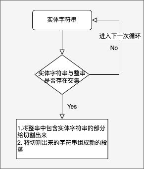

# 节点更新

## 原有设计上将节点更新分为： 

- 分割文本 一个节点变多个节点
- 全等替换 原来节点装一层样式
- 组合文本筛选 原有节点

以上的设计是有局限性的，抽象能不够。导致了不能cover住所有场景。

## 抽象

已知条件：

- 原文的字符
- 实体抽取后的字符

```
实体： 北京

我爱北京

我 爱 北京
我爱北 京

我 爱 北 京
```

无论怎样变化，字符串与字符串之间的关系，无外乎是否产生交集，如何判断是否有交集，我们需要将字符串转化为集合的表示。例如：

```
全是闭区间

整串 [0, 3]
子串 [2, 3]
```

## 实现




